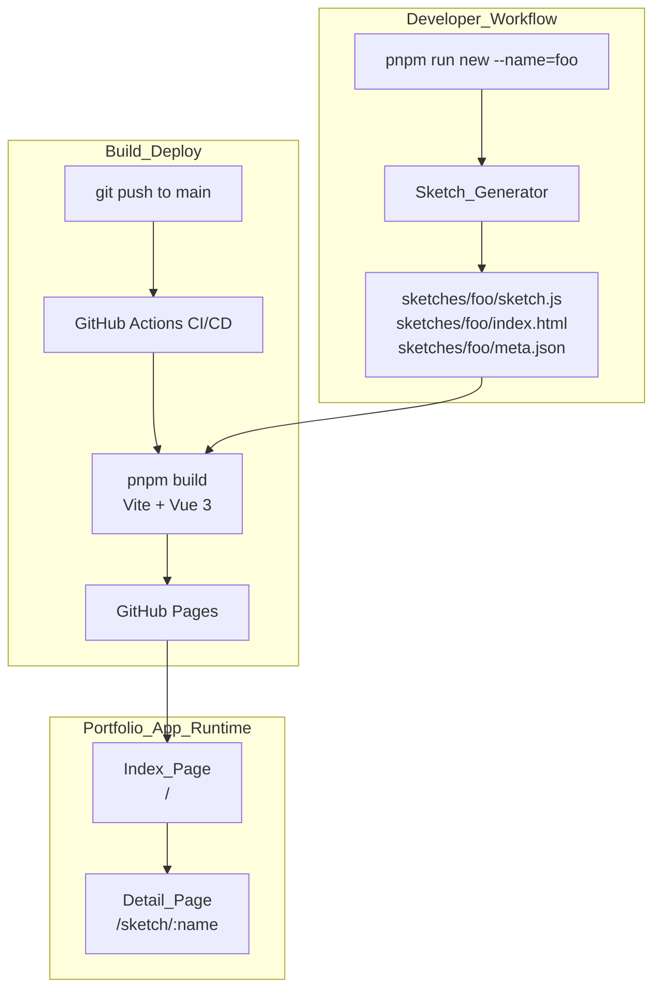

# Design Document: p5js-portfolio

## Overview

p5.jsの学習・制作を支援する2つのコンポーネントで構成されるシステム。

1. **Portfolio_App** — Vue 3 + Vite + Vue Router で構築されたSPA。`sketches/` ディレクトリを静的にスキャンし、作品の一覧（Index_Page）と個別表示（Detail_Page）を提供する。GitHub Pages へデプロイされる。

2. **Sketch_Generator** — Node.js スクリプト。`pnpm run new --name=<sketch_name>` で呼び出され、`templates/` 内のテンプレートをコピーして新しい Sketch の雛形を生成する。

CI/CD_Pipeline は GitHub Actions で実装され、`main` ブランチへの push をトリガーに自動ビルド・デプロイを行う。

---

## Architecture



### ディレクトリ構造

```
repo-root/
├── templates/
│   ├── sketch.js          # Sketch_Template（ユーザーカスタマイズ可）
│   └── index.html         # Sketch_Template（ユーザーカスタマイズ可）
├── sketches/
│   └── <sketch_name>/
│       ├── sketch.js
│       ├── index.html
│       └── meta.json      # オプション（title, description）
├── src/
│   ├── main.js
│   ├── router/index.js
│   ├── pages/
│   │   ├── IndexPage.vue
│   │   └── DetailPage.vue
│   └── components/
│       └── SketchCard.vue
├── scripts/
│   └── new-sketch.js      # Sketch_Generator
├── vite.config.js
├── package.json
└── .github/
    └── workflows/
        └── deploy.yml
```

---

## Components and Interfaces

### Portfolio_App

#### Router（Vue Router）

| Route | Component | 説明 |
|-------|-----------|------|
| `/` | `IndexPage.vue` | 全Sketchの一覧 |
| `/sketch/:name` | `DetailPage.vue` | 個別Sketchの表示 |

#### IndexPage.vue

- ビルド時に Vite の `import.meta.glob` で `sketches/*/meta.json` を静的スキャン
- `meta.json` が存在しない Sketch はディレクトリ名をタイトルとして代替表示
- Sketch が0件の場合は空状態メッセージを表示
- 各 Sketch を `SketchCard.vue` でレンダリング

#### DetailPage.vue

- `$route.params.name` で対象 Sketch を特定
- `<iframe src="/sketches/:name/index.html">` で p5.js キャンバスをレンダリング
- タイトル・説明文を表示
- Index_Page へ戻るリンクを提供

#### SketchCard.vue

- Props: `name: string`, `title: string`, `description?: string`
- Detail_Page へのリンクを含むカードコンポーネント

### Sketch_Generator（scripts/new-sketch.js）

```
入力: --name=<sketch_name>
処理:
  1. 引数バリデーション（name が未指定の場合はエラー）
  2. sketches/<sketch_name>/ の存在チェック（既存の場合はエラーで中断）
  3. templates/sketch.js, templates/index.html の存在確認
     → 存在しない場合はデフォルトテンプレート文字列を使用
  4. sketches/<sketch_name>/ ディレクトリを作成
  5. sketch.js, index.html をコピー／生成
  6. 生成ファイルのパスを標準出力に表示
出力: 生成ファイルパス（stdout）またはエラーメッセージ（stderr）
```

### CI/CD_Pipeline（.github/workflows/deploy.yml）

```
トリガー: push to main
ステップ:
  1. actions/checkout
  2. pnpm setup + install
  3. pnpm build（Vite）
  4. actions/deploy-pages（dist/ → GitHub Pages）
エラー時: GitHub Actions ジョブサマリーにエラーログを出力
```

---

## Data Models

### SketchMeta（meta.json）

```typescript
interface SketchMeta {
  title: string;        // 表示タイトル
  description?: string; // 説明文（省略可）
}
```

### SketchEntry（アプリ内部モデル）

```typescript
interface SketchEntry {
  name: string;         // ディレクトリ名（URLスラッグ）
  title: string;        // meta.json の title、なければ name
  description?: string; // meta.json の description
}
```

### デフォルトテンプレート（Sketch_Generator フォールバック）

`templates/sketch.js` が存在しない場合に使用するインラインテンプレート:

```javascript
// sketch.js default template
function setup() {
  createCanvas(400, 400);
}

function draw() {
  background(220);
}
```

`templates/index.html` が存在しない場合に使用するインラインテンプレート:

```html
<!DOCTYPE html>
<html lang="ja">
<head>
  <meta charset="UTF-8" />
  <title>Sketch</title>
  <script src="https://cdn.jsdelivr.net/npm/p5@1/lib/p5.min.js"></script>
</head>
<body>
  <script src="./sketch.js"></script>
</body>
</html>
```

---

## Correctness Properties

*A property is a characteristic or behavior that should hold true across all valid executions of a system — essentially, a formal statement about what the system should do. Properties serve as the bridge between human-readable specifications and machine-verifiable correctness guarantees.*

### Property 1: 一覧レンダリングの網羅性

*For any* SketchEntry のリスト（1件以上）に対して、IndexPage のレンダリング結果には各エントリのタイトルがすべて含まれる。

**Validates: Requirements 1.1, 1.2**

### Property 2: Detail_Page の iframe src 正確性

*For any* 有効な sketch 名に対して、DetailPage がレンダリングする `<iframe>` の `src` 属性は `/sketches/<name>/index.html` と一致する。

**Validates: Requirements 2.2**

### Property 3: Detail_Page のコンテンツ完全性

*For any* SketchEntry（title, description を持つ）に対して、DetailPage のレンダリング結果には title・description・Index_Page へ戻るリンク（href="/"）がすべて含まれる。

**Validates: Requirements 2.3, 2.4**

### Property 4: Sketch_Generator によるファイル生成

*For any* 有効な sketch 名（英数字・ハイフン・アンダースコアで構成）に対して、`new-sketch.js` を実行すると `sketches/<name>/sketch.js` と `sketches/<name>/index.html` が生成される。

**Validates: Requirements 4.1**

### Property 5: テンプレートのコピー正確性

*For any* テンプレートファイルの内容に対して、Sketch_Generator が生成したファイルの内容はテンプレートの内容と一致する。

**Validates: Requirements 4.2, 4.4**

### Property 6: 既存ディレクトリへの上書き防止

*For any* 既に存在するディレクトリ名を `--name` に指定した場合、Sketch_Generator はエラーを返し、既存ファイルを変更しない。

**Validates: Requirements 4.5**

### Property 7: 生成パスの標準出力

*For any* 有効な sketch 名に対して、Sketch_Generator の標準出力には生成された各ファイルのパスが含まれる。

**Validates: Requirements 4.6**

### Property 8: ディレクトリスキャンの網羅性

*For any* `sketches/` 以下に配置された Sketch ディレクトリに対して、Portfolio_App のスキャン結果（SketchEntry リスト）にはそのディレクトリが含まれる。

**Validates: Requirements 5.1, 5.2**

### Property 9: meta.json ラウンドトリップ

*For any* `meta.json`（title, description を持つ）に対して、Portfolio_App が読み込んだ SketchEntry の title と description は meta.json の値と一致する。

**Validates: Requirements 5.3**

### Property 10: meta.json 不在時のフォールバック

*For any* `meta.json` が存在しない Sketch ディレクトリ名に対して、Portfolio_App が生成する SketchEntry の title はそのディレクトリ名と一致する。

**Validates: Requirements 5.4**

---

## Error Handling

| シナリオ | 対応 |
|----------|------|
| `--name` 未指定 | stderr にエラーメッセージを出力してプロセス終了（exit code 1） |
| 同名ディレクトリが既存 | stderr にエラーメッセージを出力して処理中断（exit code 1）、既存ファイルは変更しない |
| `templates/` が存在しない | デフォルトテンプレート文字列を使用して生成を継続 |
| `meta.json` が不正な JSON | ディレクトリ名をタイトルとして代替表示し、エラーはコンソールに警告として出力 |
| Vite ビルド失敗 | GitHub Actions がジョブを失敗としてマークし、エラーログをジョブサマリーに出力 |
| 存在しない Sketch への直接アクセス | Vue Router の catch-all ルートで 404 ページを表示 |

---

## Testing Strategy

### デュアルテストアプローチ

ユニットテストとプロパティベーステストを組み合わせて包括的なカバレッジを実現する。

- **ユニットテスト**: 具体的な例・エッジケース・エラー条件を検証
- **プロパティテスト**: 全入力に対して成立する普遍的な性質を検証

### ユニットテスト（Vitest）

対象:
- `IndexPage.vue`: 空リスト時の空状態メッセージ表示（Requirement 1.3）
- `scripts/new-sketch.js`: テンプレートなし時のデフォルトテンプレート使用（Requirement 4.3）
- `.github/workflows/deploy.yml`: `on.push.branches` に `main` が含まれること（Requirement 3.1）

### プロパティベーステスト（fast-check + Vitest）

各プロパティテストは最低 100 イテレーション実行する。

| テスト | 対応プロパティ | タグ |
|--------|--------------|------|
| 任意の SketchEntry リストで全タイトルが IndexPage に含まれる | Property 1 | `Feature: p5js-portfolio, Property 1: 一覧レンダリングの網羅性` |
| 任意の sketch 名で iframe src が正しいパスになる | Property 2 | `Feature: p5js-portfolio, Property 2: Detail_Page の iframe src 正確性` |
| 任意の SketchEntry で DetailPage にタイトル・説明・戻りリンクが含まれる | Property 3 | `Feature: p5js-portfolio, Property 3: Detail_Page のコンテンツ完全性` |
| 任意の有効な sketch 名でファイルが生成される | Property 4 | `Feature: p5js-portfolio, Property 4: Sketch_Generator によるファイル生成` |
| 任意のテンプレート内容が生成ファイルに正確にコピーされる | Property 5 | `Feature: p5js-portfolio, Property 5: テンプレートのコピー正確性` |
| 任意の既存ディレクトリ名で上書きが発生しない | Property 6 | `Feature: p5js-portfolio, Property 6: 既存ディレクトリへの上書き防止` |
| 任意の有効な sketch 名で生成パスが stdout に含まれる | Property 7 | `Feature: p5js-portfolio, Property 7: 生成パスの標準出力` |
| 任意の Sketch ディレクトリがスキャン結果に含まれる | Property 8 | `Feature: p5js-portfolio, Property 8: ディレクトリスキャンの網羅性` |
| 任意の meta.json 内容が SketchEntry に正確に反映される | Property 9 | `Feature: p5js-portfolio, Property 9: meta.json ラウンドトリップ` |
| meta.json なしの任意のディレクトリ名が title にフォールバックされる | Property 10 | `Feature: p5js-portfolio, Property 10: meta.json 不在時のフォールバック` |

### テストツール

- **Vitest**: ユニットテスト・プロパティテストのランナー
- **fast-check**: プロパティベーステストライブラリ（TypeScript/JavaScript 対応）
- **@vue/test-utils**: Vue コンポーネントのテストユーティリティ
- **happy-dom** または **jsdom**: Vitest の DOM 環境
